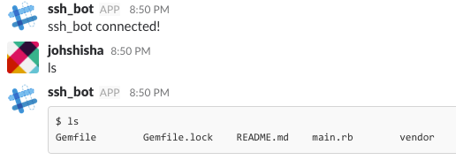

# なんだこれ
Slack経由で擬似的にSSHするためのBOT  

学内のPCを外部からSSHしたくて作成した  
ラグはあるし，補完は効かないので，普段使いには向かない  

操作したいPCで本スクリプトを実行しておくと，Slackから操作できるようになる（僕の場合は学内のPCで実行しておく）  

## 用途（個人的な）
- ちょっとした実験結果の確認  
- 他の人のマシンにサクッとSSHできる  
遠隔で他の人のマシン状態がわかるので，指導が楽になる（TOKENは漏れる笑）  

## 使用イメージ
↓こんな感じ  



# セットアップ
1. いい感じにSlackのアプリを作成し，TOKENを取得する  
2. 以下のコマンド実行
  ```
  $ git clone https://github.com/johshisha/slack_ssh_bot
  $ cd slack_ssh_bot
  $ cp .env.sample .env
  $ bundle 
  ```
3. TOKENの設定  
取得したTOKENを `.env`に記載  

# 実行
```
$ bundle exec ruby main.rb
```

## 環境
### ruby
ruby 2.4.1p111
### machine
MacOS Sierra
